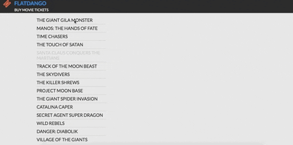

# Flatdango

This is a movie ticketing app by *Michael George* first created on 05/04/2024

## Description

This is an application, Flatdango, that allows a user to purchase movie tickets from the
theater.

## Demo



## How to Run

### Requirements

* Browser
* Computer with a connection to the internet

### Installation Process

1. Clone this repository using

    ```bash
      git clone git@github.com:migeroreloaded/sa-03-wk3-code-challenge.git
    ```

    or by downloading a ZIP file of the code.
  
2. The repository, if downloaded as a .zip file will need to be extracted to your preferred location.

3. Navigate to the project folder on your bash terminal.

4. Install dependancies using

    ```bash
      npm install
    ```

5. Run this command to get the backend/terminal started:

    ```console
      json-server --watch db.json
    ```

6. Then, open the `index.html` file on your browser to run the application.

## Technolgies used

*JS
*API

## Contact

For any questions or concerns please reach out to me at:  
[Email](mailto:mikeroche138@gmail.com)

## License

The content of this site is licensed under the MIT license

Copyright &copy; 2024 Migero

Permission is hereby granted, free of charge, to any person obtaining a copy of this software and associated documentation files (the "Software"), to deal in the Software without restriction, including without limitation the rights to use, copy, modify, merge, publish, distribute, sublicense, and/or sell copies of the Software, and to permit persons to whom the Software is furnished to do so, subject to the following conditions:

The above copyright notice and this permission notice shall be included in all copies or substantial portions of the Software.

THE SOFTWARE IS PROVIDED "AS IS", WITHOUT WARRANTY OF ANY KIND, EXPRESS OR IMPLIED, INCLUDING BUT NOT LIMITED TO THE WARRANTIES OF MERCHANTABILITY, FITNESS FOR A PARTICULAR PURPOSE AND NONINFRINGEMENT. IN NO EVENT SHALL THE AUTHORS OR COPYRIGHT HOLDERS BE LIABLE FOR ANY CLAIM, DAMAGES OR OTHER LIABILITY, WHETHER IN AN ACTION OF CONTRACT, TORT OR OTHERWISE, ARISING FROM, OUT OF OR IN CONNECTION WITH THE SOFTWARE OR THE USE OR OTHER DEALINGS IN THE SOFTWARE.
